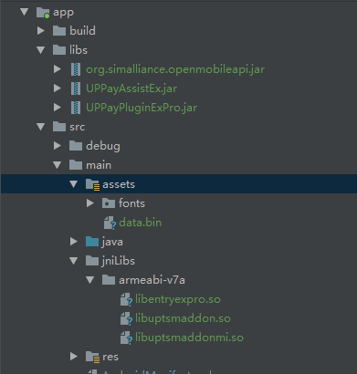

## RN和Android原生代码交互
 RN 和原生代码的交互方式，这部分知识可以参考 https://reactnative.cn/docs/native-modules-android/ ，项目中用于银联支付Module 为 UPPayModule。

## 引入银联支付
 引入银联支付，需要先到银联开发平台( https://open.unionpay.com/tjweb/acproduct/list?apiservId=450)下载开发资料，里面包含开发者需要的 SDK 和开发文档.
[中国银联手机支付控件接入指南Android_v3.2.0.pdf](uploads/a8435b8d15c93a5f169baca28ef2c8da/中国银联手机支付控件接入指南Android_v3.2.0.pdf)

## 引入SDK文件
 按照 PDF 文件里的知道，引入需要的 jar包、so文件，引入后项目结构如下，
  
## 银联支付流程
 - 从后台获取银联支付流水号
 - 将得到的流水号以及环境参数唤起银联支付SDK
 - 在 onActivityResult 方法里获取用户唤起银联支付后的操作结果
