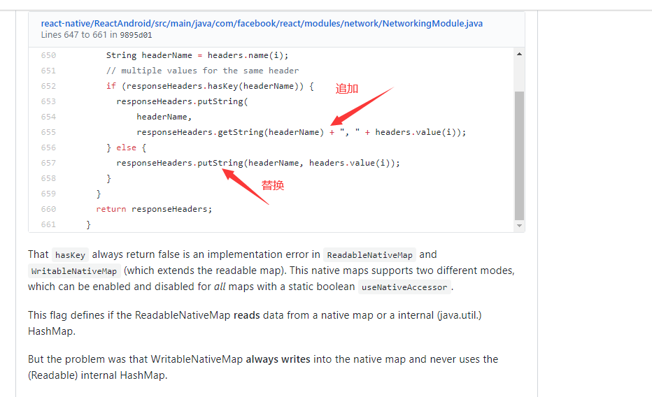
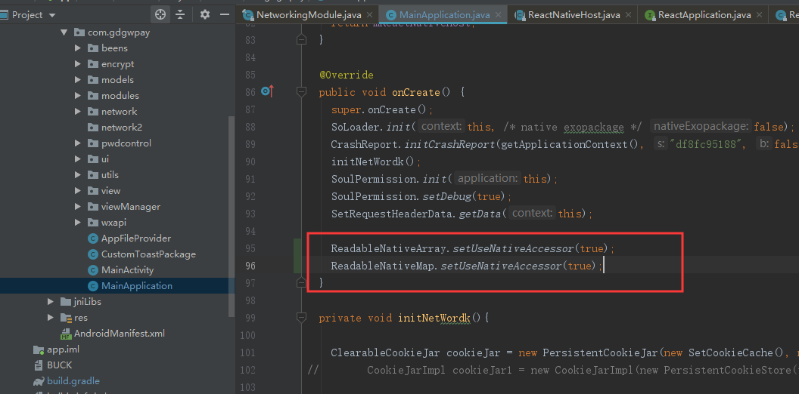

## 问题描述
  Fetch 进行网络请求，发现返回的响应头如果有多个同名的Header,在 iOS 端可以正常获取到所有同名的 Header，但是 Android 端只能获取到一个 Header。例如响应头返回了 2 个Set-Cookie，分别为 route、GW_SESSIONID，iOS 可以两个都获取到，但是安卓只能获取到一个 GW_SESSIONID ,导致访问后台的接口出错。

## 项目环境
  目前（2019-12-6）项目中的React Native 版本为 0.59.9

## 原因
 React Native 的 Java 源码中存在 bug,导致原本多个同名 Header 的值应该被追加而出现替换的情况。
  

## 解决方法
   ### 临时方案
    可以在 MainApplication 的 onCreate 方法中添加如下两行代码。这是临时解决方法，不确定会不会出现其他副作用,但是目前项目测试没发现有其他问题。
    ReadableNativeArray.setUseNativeAccessor(true);
    ReadableNativeMap.setUseNativeAccessor(true);

 ### Header 是 Set-Cookie 的解决方法
   如果出现问题的Header 是 Set-Cookie ，推荐在 Fetch 里添加 credentials = "include" 字段，Fetch 在 Android 端发送网络请求是依靠原生的 OkHttp 网络库的，OKHttp 发现设置了 credentials  字段，会自己在原生代码那里自动处理 Cookie。  JS 端不需要做其他操作。

## 参考链接
  https://github.com/facebook/react-native/issues/23185

  https://github.com/facebook/react-native/issues/23005

 
