## 为何要将Android端第三方库的原生代码打包成 arr 文件？
 1.首先从RN  npm install 引入第三方库说起，以项目引入 react-native-picker 为例，如果引入的第三方库功能实现需要用到平台特性功能（如 picker 库会调用系统相机拍照或者从系统相册挑选照片），那么在 npm install 引入第三方库之后，会在在 node_modules 目录下会看到 picker 库在两个平台的工程文件。
 ### npm install 完成后，在node_modules下的截图
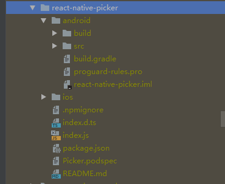
 ### react-native link 
  npm install 只是下载了第三方库的工程文件，此时并没有关联起来作为子工程被主工程依赖，所以需要 link 这个步骤。link 完成后，会修改主工程的三处地方
 
1.在 settings.gradle 声明子工程并且声明工程的路径
  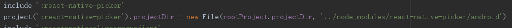
 

2.在主工程的 app 路径下的 build.gradle 依赖子工程
  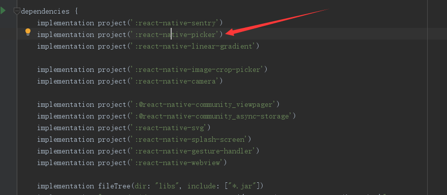

3.在 MainApplication 的 getPackages 方法里添加 new PickerViewPackage()
  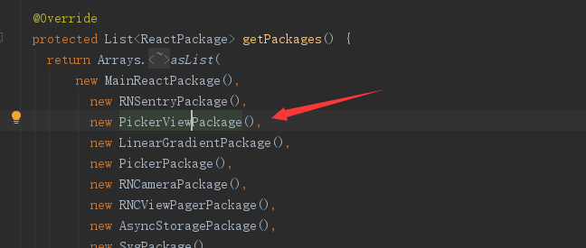
  
  经过这些操作，第三方子工程被主工程依赖，在 run-android 的时候子工程原生代码会参与到整个编译环节，一个 Java  文件的编译过程会经历 .java ---> .class ---> dex  ，所以如果java 文件越多，编译时间越长。因为引入的第三方java文件不需要改动，所以可以直接将第三库打包成 arr 文件。 [arr 文件是安卓归档文件](https://www.jianshu.com/p/0a2572a63ed5)，包含了从java文件编译而来的class文件以及第三方库的所有资源文件。

## 如何将第三方库打包成
 在 react-natvie run-android 成功运行起项目或者 gradlew assembleRelease 打包完成后，可以在子工程的 build/outputs/arr 目录下得到

   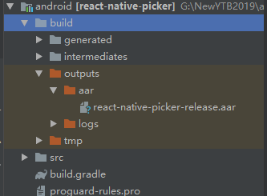

## 项目中引入 arr 文件
 1.将得到的 arr 文件放入主工程 app/libs 目录下

   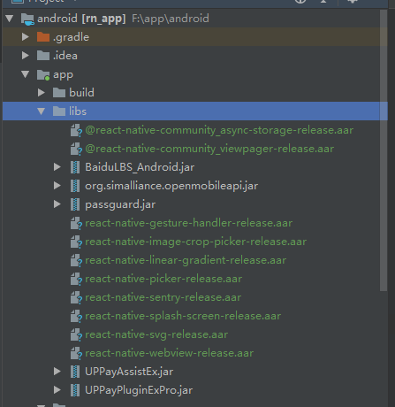

 2.在 settings.gradle 里注释子工程声明
     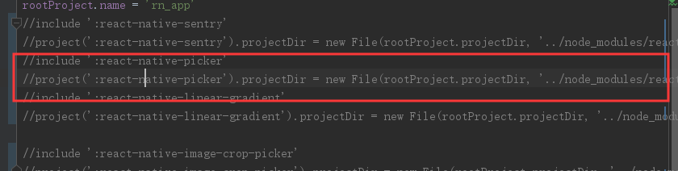

 3.在 app 目录下的 build.gradle 文件 dependencies块级里注释 implementation 依赖,同时新增 arr 文件依赖
     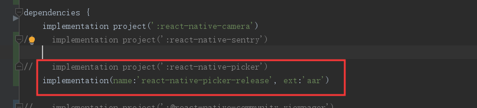
    
  4.如果第三方库还有依赖其他库，相应的也要把依赖的代码放在 app 目录 build.gradle 文件 dependencies块级里。这个步骤不是必须的，只有第三方库有依赖其他库才需要!!!
   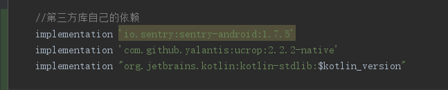

  5.在和 dependencies 同级别的位置添加如下代码
   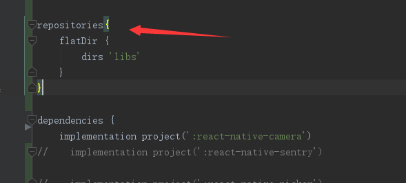

  6.点击 sync now 同步工程，完成整个步骤
   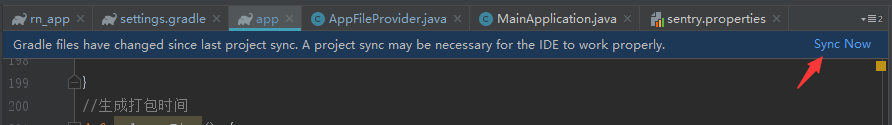

