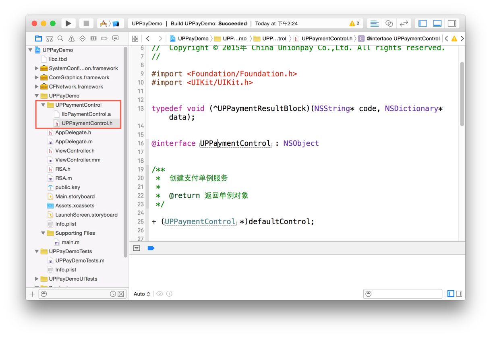
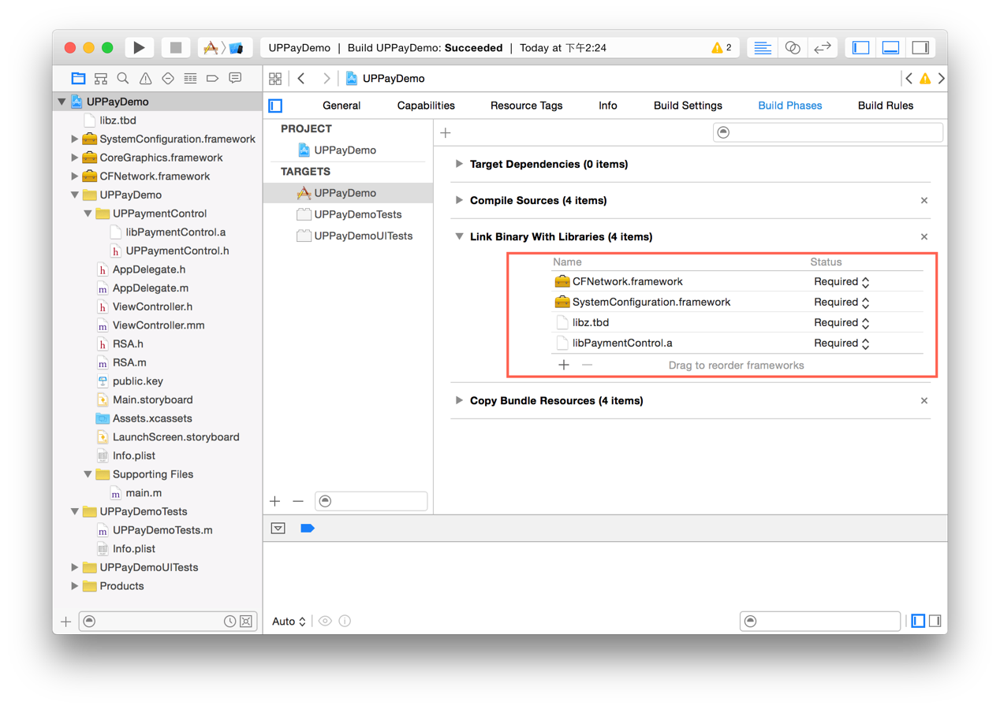

1、添加SDK包
使用UPPaymentControl需要将UPPaymentControl.h文件和libPaymentControl.a文件添加到应用的工程中，添加后如图：


2、使用UPPaymentControl需要添加CFNetwork.framework、systemConfiguration.framework 、libz、libPaymentControl.a到工程中，添加后如下图：


3、由于React-Native运行在iOS子线程，无法直接调用银联SDK，需要通过桥接文件跳转原生页面调起银联SDK

1>在React-Native的根控制器`YTBBaseViewController`上注册调起银联支付`openUPPaymentNotification`的通知
```
    // 打开银联支付
    [[NSNotificationCenter defaultCenter] addObserver:self selector:@selector(openUPPayment:) name:@"openUPPaymentNotification" object:nil];
```
2>创建桥接文件UPPaymentManager，导出模块，提供接口供RN调用
```javaScript
// 导出桥接模块
RCT_EXPORT_MODULE()

// RN跳转原生界面
RCT_EXPORT_METHOD(pay:(NSString *)tn){
  dispatch_async(dispatch_get_main_queue(), ^{
    [[NSNotificationCenter defaultCenter]postNotificationName:@"openUPPaymentNotification" object:nil userInfo:@{@"tn":tn}];
  });
}
```
3> 在需要调起银联SDK的模块页面上引入`import {NativeModules} from "react-native"`,调用桥接文件导出的模块接口即可
```
let UPPaymentManager = NativeModules.UPPaymentManager;
            UPPaymentManager.pay("[tn订单流水号]");
```

备注：银联SDK下载路径
https://open.unionpay.com/ajweb/help/file/toDetailPage?id=666&flag=1