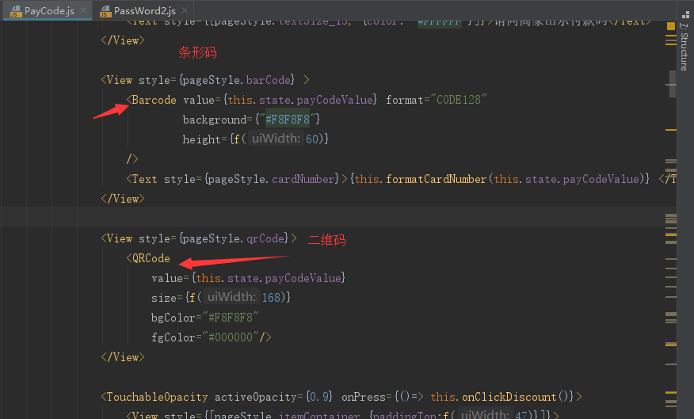
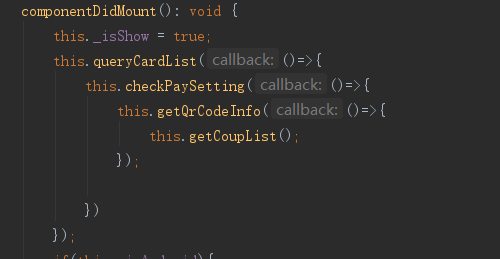

## 条形码、二维码
  1.引入第三方库生成二维码条形码, this.state.payCodeValue 为从后台获取的支付码数字串。  
  2.付款码一分钟刷新一次，每 5 秒轮询一次支付状态  

  
  
## 付款码页面流程  
      
  1.获取预付卡列表，判断有没预付卡，没有的话，弹框提示前往绑卡页面。   
  2.有预付卡了，查询支付设置接口，判断是否设置了支付密码，没有的话，弹框提示前往设置支付密码。  
  3.设置了支付密码，通过预付卡号、优惠券号（默认空）获取支付码。   
  4.将得到的支付码数字串渲染生成条形码、二维码。   
  5.最后调用优惠券接口，获取优惠券信息。   

## Tips
 以下操作都需要重新获取支付码再生成条形码、二维码  
 1.选择了不同的优惠券  
 2.选择了不同的预付卡号  
 3.从付款码页面前往设置支付密码后回来  
 4.支付失败后重新刷新   
 5.轮询支付结果失败重新刷新   
 

