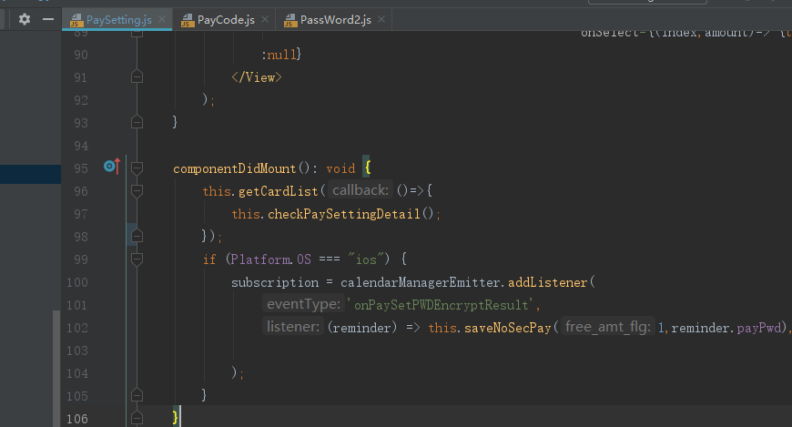

## 数字密码框
  项目中的密码框控件由Android 与 iOS 两端分别引入，Android 端引入的控件为 RCTPassGuardEdit ,iOS 为 RCTPasswordGuardView。获取控件密码加密后的密文需要 RSA 公钥和随机因子，所以流程为，在 RN 网络请求随机因子（RAS公钥固定），再将公钥和随机因子传递给原生控件，由原生控件得到加密后的密文，再将其传递到 RN。

## 与密码相关的后台API
  项目中的与密码相关的接口均使用到了小程序的接口，由于RN版 APP 密码控件的加密方式与小程序的不同，后台不能直接解密，需要在参数上附带 old_decrypt_way = "1" 提醒后台使用与APP适配的解密方式。涉及接口有 ：

 忘记密码
https://testepay.96533.com:23543/gwzfpay/WxfForgetPayPwd.wxf

首次设置密码
https://testepay.96533.com:23543/gwzfpay/WxfSetPayPwd.wxf

验证支付密码
https://testepay.96533.com:23543/gwzfpay/WxfChkPayPwd.wxf

修改支付密码
https://testepay.96533.com:23543/gwzfpay/WxfModifyPayPwd.wxf

免密支付开关
https://testepay.96533.com:23543/gwzfpay/WxfNoSecSwitch.wxf

## 支付设置缓存
  进入支付设置页面，会请求支付设置接口，获取是否设置支付密码 pay_pwd_flg，是否开启免密支付 free_amt_flg，免密额度 free_amt ,支付接口返回的信息会被缓存在 PaySettingCache 类中。更换免密额度，或者切换免密开关成功后会同步到支付缓存中。

## 支付设置业务流程
  进入 PaySetting 页面后，会先请求预付卡列表接口，判断是否绑定了预付卡，没有的话弹框提醒前往绑定预付卡。绑定预付卡后，再请求支付设置接口。没设置支付密码，弹框提示设置先设置支付密码。

